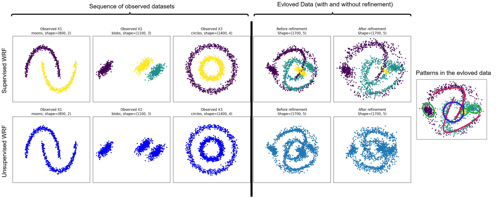
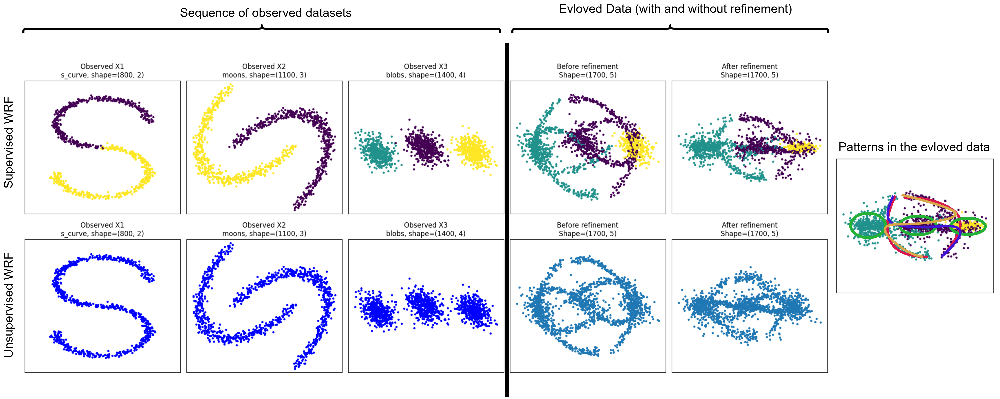
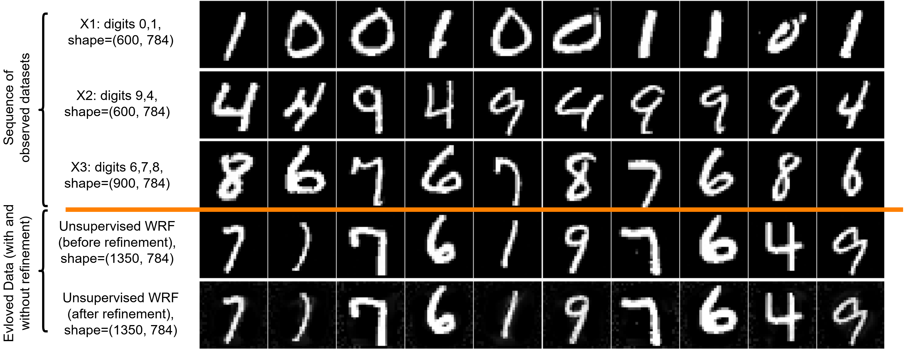
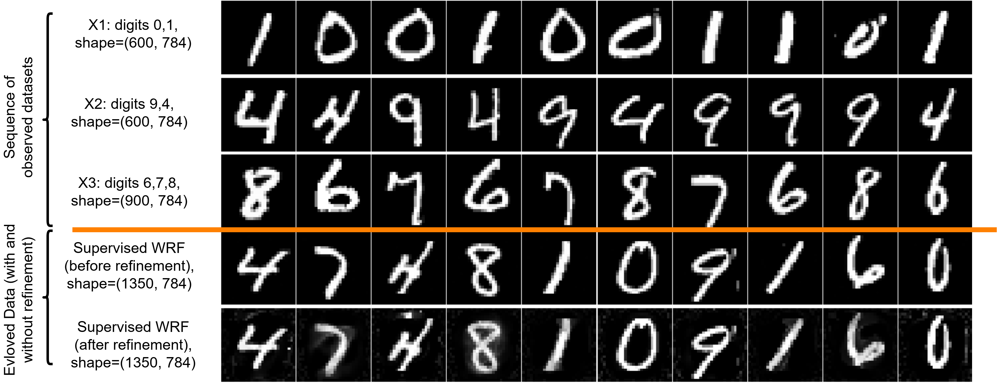

# WRF Data Evolution

This is the code for the paper:
- Aydin Ghojogh, Benyamin Ghojogh, "Data Evolution by Wittgenstein's Rule Following", arXiv, 2026.

# An Example for Wittgenstein's Rule Following

In Wittgenstein's Philosophical Investigations (§§185-190), Wittgenstein's discussion of rule following begins with examples involving the continuation of a numerical series . 

To clarify the idea, consider the following finite sequence: 

$2, 4, 8, ...$

What should the next number be? This is the kind of problem that primary-school students are sometimes asked to solve by their teachers.

## Answer 1

One natural answer is $16$. A person may infer that the sequence follows a geometric rule with common ratio $2$, since $4=2\times 2$ and $8=4\times 2$. Under this interpretation, the next term is: 

$8\times 2 = 16$.

## Answer 2

However, another person may infer a different rule. For example, one may say that the sequence is generated by alternately adding $2$ and $4$: 

$2,\quad 2+2=4,\quad 4+4=8,\quad 8+2=10,\quad \ldots$

Under this interpretation, the next number is $10$, not $16$.

## Answer 3

Many more complex rules can also be constructed. For example, consider the cubic polynomial function:

$f(n) = 1165 n^3 - 6989 n^2 + 12814 n - 6988,$

where $n$ denotes the index of the term, starting from $n=1$.
Then, we can say that:
- $n=1 \implies f(1) = 1165 (1) - 6989 (1) + 12814 (1) - 6988 = 2$
- $n=2 \implies f(2) = 1165 (8) - 6989 (4) + 12814 (2) - 6988 = 4$
- $n=3 \implies f(3) = 1165 (27) - 6989 (9) + 12814 (3) - 6988 = 8$
- $n=4 \implies f(4) = 1165 (64) - 6989 (16) + 12814 (4) - 6988 = 7004$

Therefore, the next number should be $7004$ according to the rule!

This example illustrates an important point in Wittgenstein's rule-following considerations: a finite sequence does not, by itself, uniquely determine how it must be continued. Many different rules can agree with the same observed initial terms while producing different future continuations. For Wittgenstein, the application of a rule is therefore not fixed merely by an abstract formula or by a private interpretation. Rather, what counts as continuing the rule correctly is stabilized by practice, training, examples, correction, and shared criteria of use.

This observation motivates the data-evolution problem studied in this paper. Given only a finite history of datasets, there may be many possible ways to generate a next dataset that is compatible with the observed history. The proposed WRF method addresses this ambiguity by combining two principles: rule following, which encourages continuation of the structural trend in the historical sequence, and family resemblance, which keeps the generated dataset close to the family of previously observed datasets.

# Problem Definition: Data Evolution

Consider an observed sequence of datasets:

$$\mathcal{X}_{1:T} := \lbrace\mathbf{X}_1,\ldots,\mathbf{X}_T\rbrace = \lbrace\mathbf{X}_t\rbrace_{t=1}^T,$$

where the $t$-th dataset is:

$$\mathbf{X}_t \in \mathbb{R}^{n_t \times d_t}.$$

The number of samples $n_t$ and the dimension $d_t$ are allowed to vary with $t$. 

In the supervised case, each dataset is equipped with labels:

$$\mathcal{Y}_{1:T} := \lbrace\mathbf{y}_1,\ldots,\mathbf{y}_T\rbrace = \lbrace\mathbf{y}_t\rbrace_{t=1}^T,$$

where $\mathbf{y}_t \in \lbrace 1, 2, \dots, K_t\rbrace^{n_t}$ is the vector of labels and $K_t$ is the number of classes in the dataset $\mathbf{X}_t$.

The goal is to evolve, or generate, a new dataset:

$$\widehat{\mathbf{X}}_{T+1} \in \mathbb{R}^{\widehat{n}_{T+1}\times \widehat{d}_{T+1}},$$

which continues the rule implicit in the sequence $\lbrace\mathbf{X}_1,\ldots,\mathbf{X}_T\rbrace$. 
In the supervised case, the labels of the data instances in the evolved dataset should also be generated:

$$\widehat{\mathbf{y}}_{T+1} \in \lbrace 1, 2, \dots, K_{T+1} \rbrace^{\widehat{n}_{T+1}},$$

where $K_{T+1}$ is the number of classes in the dataset $\widehat{\mathbf{X}}_{T+1}$.

Importantly, the algorithm has only access to the sequence of datasets and possibly to their labels in the supervised case. 
Candidate datasets are constructed from the observed history $\lbrace\mathbf{X}_1,\ldots,\mathbf{X}_T\rbrace$, and, in the supervised case, from the label history $\lbrace\mathbf{y}_1,\ldots,\mathbf{y}_T\rbrace$, with optional random padding and small noise injection.

The WRF algorithm is a rule-following data evolution in which the next dataset is not required to be a transformation of the last dataset. Instead, it is selected and refined to satisfy two competing principles:

- Wittgenstein's rule following: continue the rule of the sequence of datasets
- Wittgenstein's family resemblance: preserve family resemblance to the observed history

The construction is history-based, i.e., the algorithm receives only the previous datasets, and optionally their labels, and generates a continuation using descriptors, balanced historical recombination, candidate scoring, and differentiable refinement (explained in the following).

# Toy Experiments

## First Toy Experiment

Simulation of the WRF data evolution algorithm on a sequence of synthetic datasets, (1) moons, (2) blobs, and (3) circles, in both unsupervised and supervised settings. 
The two-dimensional plots of datasets are projections of the datasets onto their first and second PCA components.
As shown on the right-hand side, the evolved dataset $\mathbf{X}_4$ contains the patterns from the datasets $\mathbf{X}_1$, $\mathbf{X}_2$, and $\mathbf{X}_3$, i.e., it has the patterns of moons (shown in red curves), blobs (shown in green curves), and circles (shown in blue curve).

## Second Toy Experiment

Simulation of the WRF data evolution algorithm on a sequence of synthetic datasets, (1) S curve, (2) moons, and (3) blobs, in both unsupervised and supervised settings. 
The two-dimensional plots of datasets are projections of the datasets onto their first and second PCA components.
As shown on the right-hand side, the evolved dataset $\mathbf{X}_4$ contains the patterns from the datasets $\mathbf{X}_1$, $\mathbf{X}_2$, and $\mathbf{X}_3$, i.e., it has the patterns of S curve (shown in orange and purple curves), moons (shown in red curves), and blobs (shown in green curves).

# MNIST Digit Experiments

## Unsupervised MNIST Digit Experiment

Simulation of the WRF data evolution algorithm on a sequence of digit datasets, (1) a dataset of digits $\{0,1\}$, (2) a dataset of digits $\{4,9\}$, and (3) a dataset of digits $\{6,7,8\}$, in an **unsupervised** setting. As shown on the right-hand side, the evolved dataset $\mathbf{X}_4$ contains the patterns from the datasets $\mathbf{X}_1$, $\mathbf{X}_2$, and $\mathbf{X}_3$, i.e., it has the patterns of digits $\{1,4,6,7,9\}$.

## Supervised MNIST Digit Experiment

Simulation of the WRF data evolution algorithm on a sequence of digit datasets, (1) a dataset of digits $\{0,1\}$, (2) a dataset of digits $\{4,9\}$, and (3) a dataset of digits $\{6,7,8\}$, in a **supervised** setting. As shown on the right-hand side, the evolved dataset $\mathbf{X}_4$ contains the patterns from the datasets $\mathbf{X}_1$, $\mathbf{X}_2$, and $\mathbf{X}_3$, i.e., it has the patterns of digits $\{0,1,4,6,7,8\}$.

